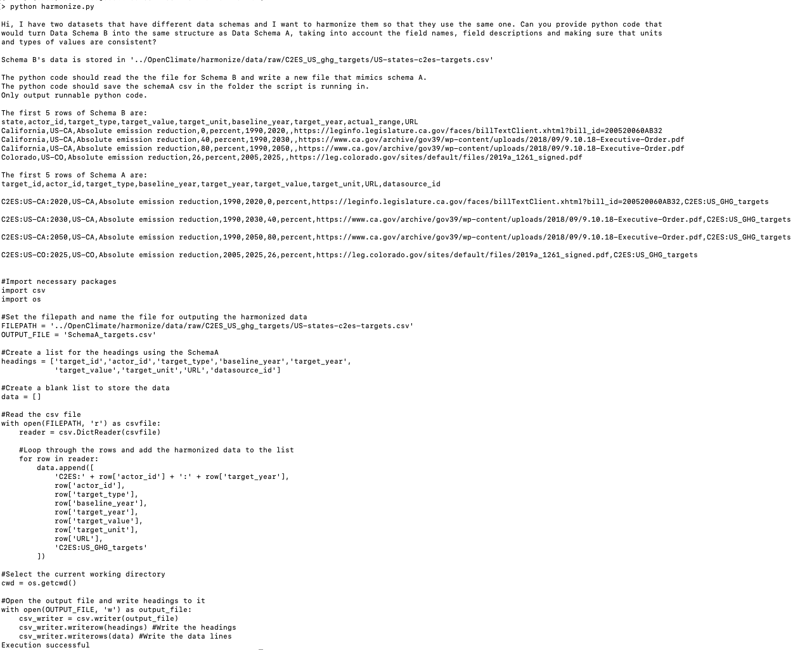

# Instructions

Run the following:

## Setup API key
`export OPENAI_API_KEY=YOURKEYHERE`

## Setup virtual environment

```
python3 -m venv venv
source venv/bin/activate
pip install -r requirements.txt
```

Download the following repo into ../:
```
git clone git@github.com:Open-Earth-Foundation/OpenClimate.git
```

## Run the code
```
python harmonizer.py
```

# Demo

